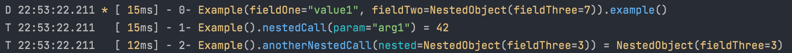

# LogDebug: kotlin @Annotations for debug/trace logs generation

## Example of output:

````
D 22:53:22.211 * [ 15ms] - 0- Example(fieldOne="value1", fieldTwo=NestedObject(fieldThree=7)).example()
T 22:53:22.211   [ 15ms] - 1- Example().nestedCall(param="arg1") = 42
T 22:53:22.211   [ 12ms] - 2- Example().anotherNestedCall(nested=NestedObject(fieldThree=3)) = NestedObject(fieldThree=3)
````
## Motivation
1. This library built around idea that code must be readable and self-explanatory. It means that all information about
what's happening in the code is encoded in functions/variables names. So to get detailed and readable debug/trace
logs, it's enough just to write them down. And remembering that function name = log message will enforce code readability.
2. Writing debug/trace logs is boring, it's easy to forget write them, and they pollute code.
3. Basic idea is to get rid of duplicating lines like this:

```kotlin
fun signIn(userName: String) {
    // This logs basically consists of method name + param name + param value
    logger.debug("Signing in... User name: $userName")
    ...
}
```
## Limitations
1. To show call stack depth it uses ThreadLocal to track current depth.
2. To show time of method execution and return value it logs all logs only after method execution.
3. To show logs in correct order, nested methods call logs will be unavailable until parent method finished execution.

So 1. and 2. may be or not a problem in case of async programming, and 3. may be a problem in case of long method runs.
In most server application those limitations will not play a role.

## Getting started
1. Add necessary dependencies to `build.gradle.kts`
```kotlin
plugins {
    id("io.freefair.aspectj.post-compile-weaving") version "6.4.1"
}

repositories {
    maven { setUrl("https://jitpack.io") }
}

dependencies {
    "aspect"("com.github.dmitryb-dev:log-debug:1.0")
    implementation("org.aspectj:aspectjrt:1.9.9.1")
}
```
2. Add Logger config for LogDebug. E.g. for logback `src/main/resources/logback.xml`:
```xml
<configuration>
    <logger name="LogDebug" level="TRACE" additivity="false">
        <appender class="ch.qos.logback.core.ConsoleAppender">
            <encoder>
                <pattern>%.-1p %msg%n</pattern>
            </encoder>
        </appender>
    </logger>
</configuration>
 ```
3. Let's try it:
```kotlin
class class Example {
    @LogDebug
    fun example() {}
}
fun main() {
    Example().example()
}
```
This lines must produce next output:
```
D 22:53:22.211 * [  0ms] - 0- Example().example()
```

## Usage by example
1. Print all params except specific:
```kotlin
class Example {
    @LogDebug
    fun example(
        param1: String,
        @LogDebugHide param2: String,
    ) {}
}
```
This will print:
```
D 22:53:22.211 * [  0ms] - 0- Example().example(param1="value")
```
2. Skip all params, but print specific one:
```kotlin
class Example {
    @LogDebugHode
    fun example(
        param1: String,
        @LogDebug param2: String,
    ) {}
}
```
```
D 22:53:22.211 * [  0ms] - 0- Example().example(param2="value")
```
3. Hide/Print return value
```kotlin
class Example {
    @LogDebugHode
    fun example(): @LogDebug Int = TODO()
}
```
```
D 22:53:22.211 * [  0ms] - 0- Example().example() = 42
```
4. Print only specific field of some object (instead of using `.toString()` which is default):
```kotlin
@LogDebugHide
class Example(
    val objectField1: String,
    @LogDebug val objectField2: String,
)
```
```
D 22:53:22.211 * [  0ms] - 0- Example(objectField2="value").example()
```
5. Object printing works as well for params and return types:
```kotlin
@LogDebug
class Example(
    val objectField1: String
) {
    @LogDebug
    fun example(param: Example): Example = TODO()
}
```
```
D 22:53:22.211 * [  0ms] - 0- Example(objectField1="value").example(param=Example(objectField1="another")) = Example(objectField1="return")
```
6. Exceptions:
```kotlin
class Example {
    @LogDebug
    fun example() {
        throw IllegalArgumentException("text", IllegalArgumentException("msg"))
    }
}
```
```
D 22:53:22.211 * [  0ms] - 0- Example().example() ! IllegalArgumentException("text"), IllegalArgumentException("msg")
```
7. To print trace log instead of debug:
```kotlin
class Example {
    @LogTrace
    fun example(
        param1: String,
        @LogTraceHide param2: String,
    ) {}
}
```
You can mix `@LogDebug` and `@LogTrace` in classes to show different fields for debug and trace logs.